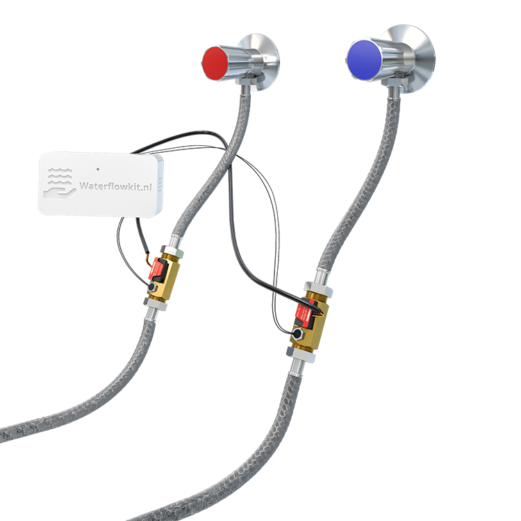
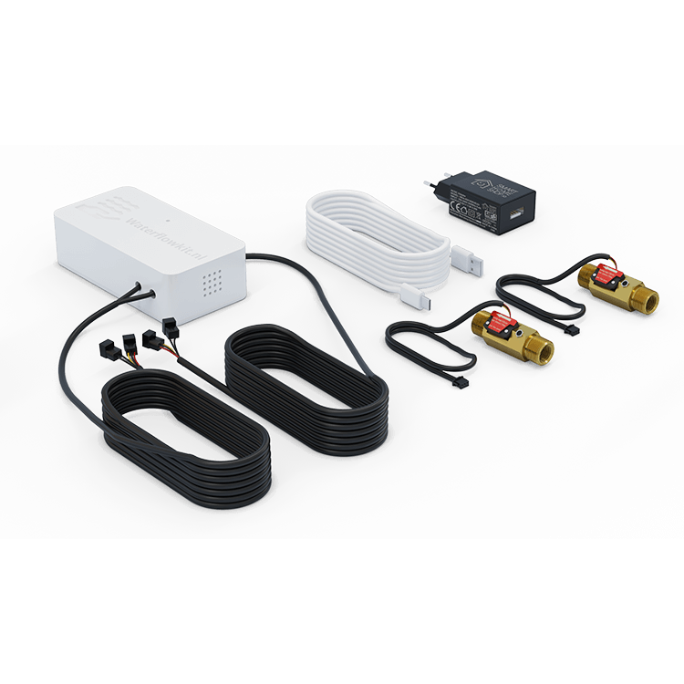

# WaterFlowKit for Home Assistant / ESPHome

WaterFlowKit is a water flow monitoring solution designed to track your water consumption in real-time. It supports dual flow sensors, water temperature sensing, and multiple connectivity options. It integrates seamlessly with Home Assistant via ESPHome and runs fully local (no cloud required).

## How it works

The WaterFlowKit connects to pulse-based water flow sensors (Hall effect) to measure water flow rate and total consumption. Each flow input also includes an NTC temperature sensor for water temperature monitoring. Compatible with popular YF-series flow sensors.

👉 **More information**: https://smarthomeshop.io/waterflowkit

## Key features

- **Dual flow monitoring**: Two independent flow sensor inputs with real-time flow rate (L/min) and total consumption (L).
- **Water temperature**: NTC temperature sensors for both flow inputs.
- **Environment sensing**: Temperature and humidity measurement (HDC1080).
- **Multiple sensor support**: YF-B1/B7, YF-B5/B6, YF-B10, YF-DN40-S, YF-DN50-S with automatic calibration.
- **Connectivity**: WiFi with captive portal fallback, Ethernet (V2), optional Cloud sync.
- **Provisioning**: Improv BLE/Serial and captive portal for easy setup.
- **Local only**: Works without cloud services (100% local); OTA supported via manifest on GitHub Pages.

## Hardware versions

| Version | Chip | Connectivity | Flow Sensors |
|---------|------|--------------|--------------|
| V1 | ESP32 | WiFi | 2x |
| V2 | ESP32-C6 | WiFi + Ethernet | 4x |

## Variants

We publish firmware variants for two hardware versions. Each variant is a dedicated YAML in the version folder and ships with a matching Web Tools manifest on the `gh-pages` branch.

| Hardware | Variant | Description |
|----------|---------|-------------|
| V1 (ESP32) | WiFi | Standard WiFi connectivity |
| V1 (ESP32) | WiFi Cloud | WiFi with Cloud sync |
| V2 (ESP32-C6) | WiFi | WiFi with Improv BLE/Serial |
| V2 (ESP32-C6) | Ethernet | Wired Ethernet connectivity |
| V2 (ESP32-C6) | WiFi Cloud | WiFi with Cloud sync |
| V2 (ESP32-C6) | Ethernet Cloud | Ethernet with Cloud sync |

## Supported flow sensors

The WaterFlowKit supports multiple flow sensor types with automatic calibration:

| Sensor Model | Pulses/Liter | Typical Use |
|--------------|--------------|-------------|
| YF-B1 / YF-B7 | ~660 | Small pipes (1/2") |
| YF-B5 / YF-B6 | ~396 | Medium pipes (3/4") |
| YF-B10 | ~450 | General purpose |
| YF-DN40-S | ~27 | Large pipes (DN40) |
| YF-DN50-S | ~12 | Large pipes (DN50) |

## Getting started

1. **Hardware**: Connect power via USB-C.
2. **Flash firmware**:
   - Use our web-based flash tool at https://smarthomeshop.io/firmware to flash or re-flash your kit.
   - Or compile/flash locally with ESPHome CLI.
3. **Onboarding**:
   - Connect to the `waterflowkit` hotspot if WiFi is not configured.
   - Use Improv BLE or Improv Serial for provisioning.
4. **Configure**: Select your flow sensor type in Home Assistant.
5. **Calibrate**: Fine-tune with the Calibration % setting if needed.

Please check for full documentation our quick start guide: https://smarthomeshop.io/quick-start-waterflowkit

## Repository layout

- `waterflowkit-v1/` — ESPHome configurations for V1 (ESP32)
- `waterflowkit-v2/` — ESPHome configurations for V2 (ESP32-C6)
- `.github/workflows/` — CI to build and publish firmware to `gh-pages`
- `gh-pages` branch — public firmware and manifests (for OTA and ESP Web Tools)

## Sensors

| Sensor | Description |
|--------|-------------|
| Flow1/Flow2 Current Usage | Water flow rate in L/min |
| Flow1/Flow2 Total Consumption | Cumulative water usage in L |
| Flow1/Flow2 Water Temperature | Water temperature in °C |
| Temperature | Environment temperature (°C) |
| Humidity | Environment humidity (%) |
| WiFi Signal | WiFi signal strength |
| Uptime | Device uptime |

## Contributing

PRs and issues are welcome. Please keep changes modular and follow ESPHome best practices.

## Support

- Product info and guides: https://smarthomeshop.io/waterflowkit
- Store: https://smarthomeshop.io
- Community & support (Discord): https://smarthomeshop.io/discord

## License

This project is released under the CC BY‑NC 4.0 license

